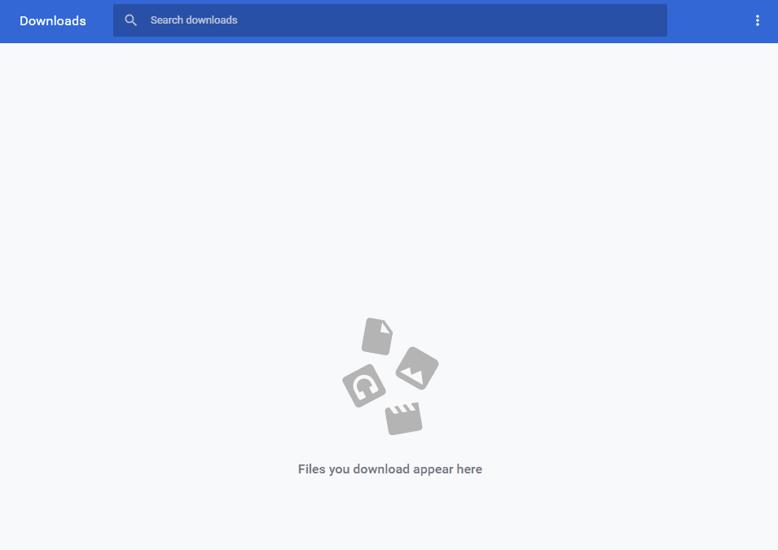

# clean-the-download-list

> this is a chrome extension.
>> Automatically clean the download list.

## install

You can install clean-the-download-list through the Chrome web store: [clean-the-download-list](https://chrome.google.com/webstore/detail/auto-clear-download-list/afgmphafdnlmmcbefefbpnimhgeilahe) 

## preview

